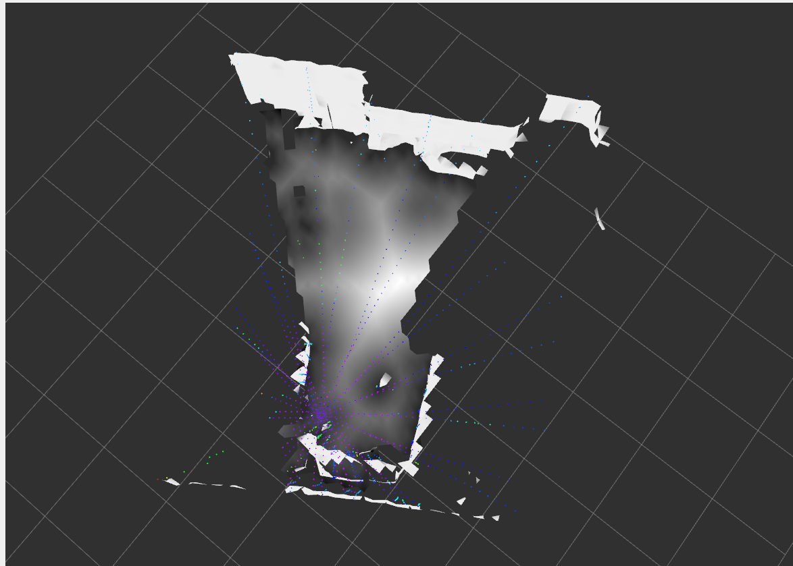

# Sdf generator
This is a ros2 version of [voxfiled](https://github.com/VIS4ROB-lab/voxfield), but the functions are very limited because of my skill and simplicity. This library has the following function. 

* Creating Non-Projective TSDF from point cloud measured by lidar. 
* Creating ESDF from Non-Projective TSDf (voxfiled)
* Rviz plugins to show surrounding surfaces. 
* Rviz plugins to show the distance from the surface, and gradient of the distance. 

# Dependencies
* Ros2-humble
* OpenCV
* Point Cloud Libray
* Eigen3

# Build and Run
```sh
colcon build --symlink-install
source install/setup.bash
ros2 launch sdf_generator_ros esdf_server.launch.py
```

# Rviz Plugins


The above picture shows the surfaces (Mesh) and distance at the designed height (SDF). The color of mesh shows the intensity of the point cloud. The whiter the color of SDF is, the longer distance is. 

# Parameters
The parameter's descriptions are written in files in `sdf_generator_ros/config`. 